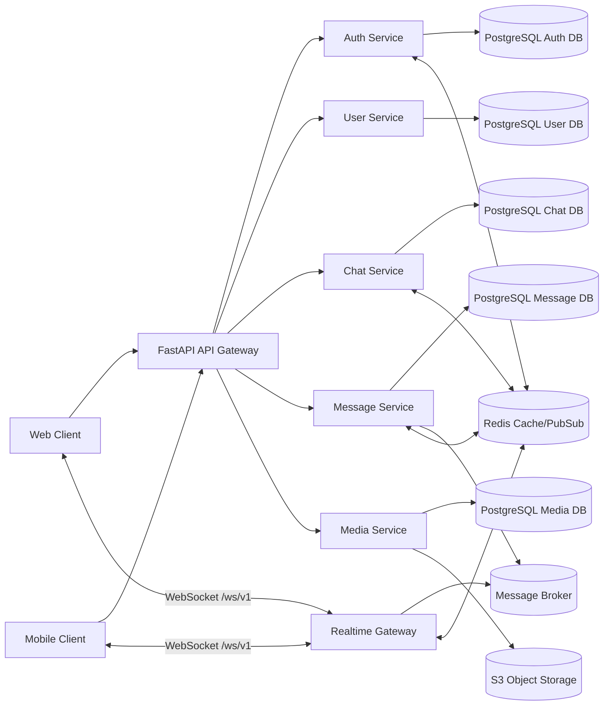
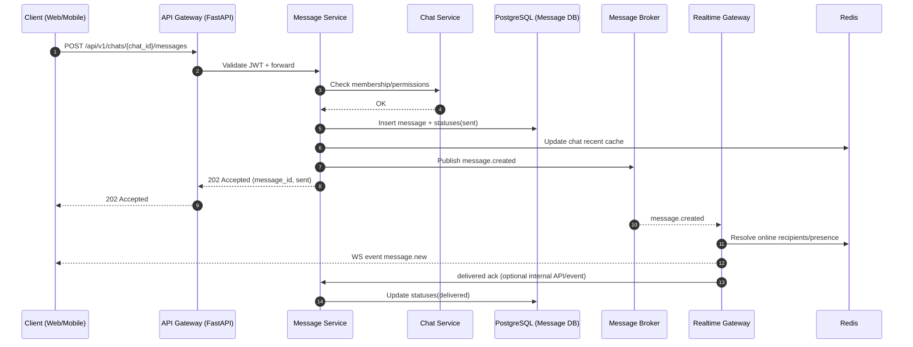
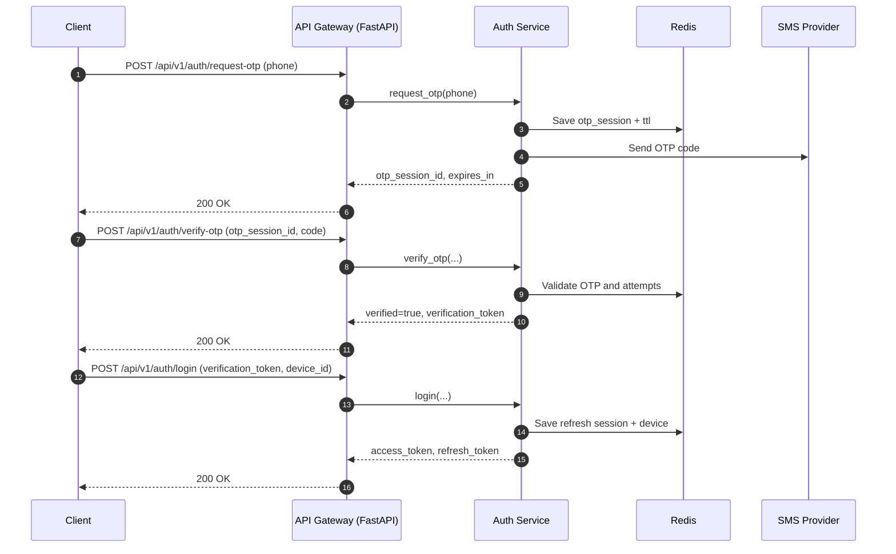
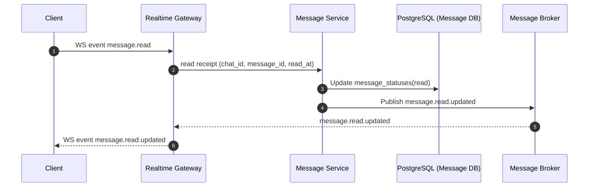

# Схема архитектуры и взаимодействия сервисов

## 1. Контейнерная схема (микросервисы)

## 2. Поток отправки и доставки сообщения

## 3. Поток аутентификации (phone + OTP + 2FA)

## 4. Поток read receipt

## 5. Где находится бизнес-логика

- Вся бизнес-логика в backend-сервисах (`Auth`, `Chat`, `Message`, `Media`).
- Клиент только отображает состояние и отправляет команды (`REST`/`WebSocket`).
- `API Gateway` не хранит доменную логику, только входной контур (authn, routing, limits, tracing).

## 6. Границы ответственности

- `Auth Service`: OTP/2FA, токены, сессии.
- `Chat Service`: чаты, участники, unread counters.
- `Message Service`: создание сообщений, история, статусы доставки/прочтения.
- `Media Service`: загрузка и валидация изображений, metadata + presigned URL.
- `Realtime Gateway`: живые события и fan-out в подключенные клиенты.
