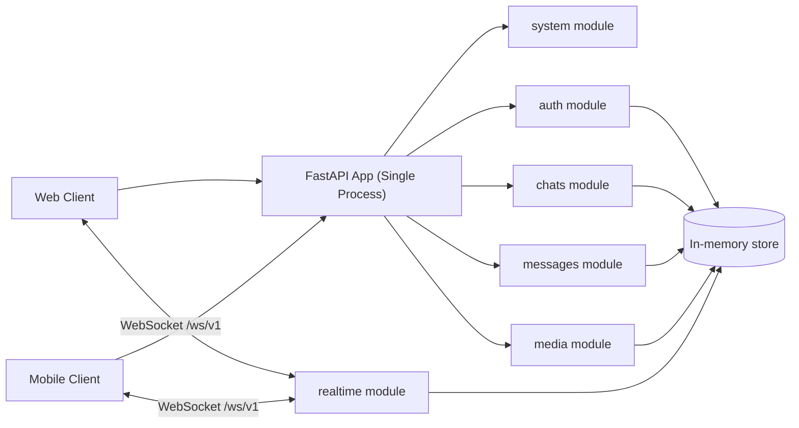
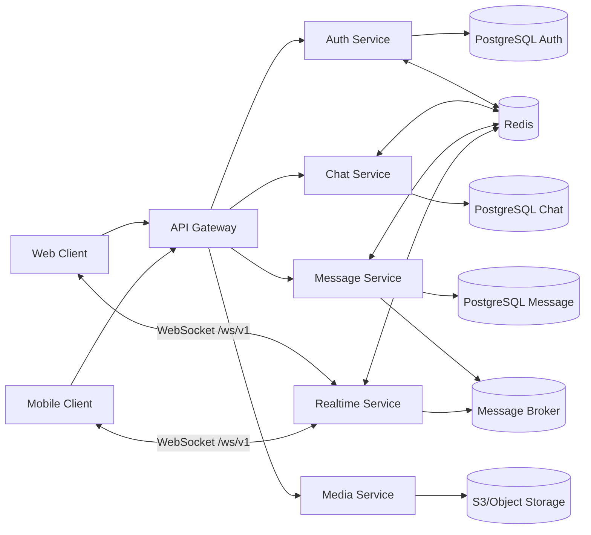

# Схема архитектуры и декомпозиции сервисов

## 1. Текущая реализация (as-is)

## 2. Целевая архитектура (to-be)

## 3. Последовательность миграции

1. Стабилизировать контракты API и добавить контрактные тесты.
2. Вынести `state/store.py` в отдельный слой репозиториев.
3. Подменить in-memory репозитории на PostgreSQL/Redis-реализации.
4. Выделить `auth` как отдельный сервис и проксировать через gateway.
5. Выделить `chats` и `messages` с event-шиной для realtime.
6. Выделить `media` с object storage и presigned URL.
7. Выделить `realtime` в отдельный процесс с pub/sub.

## 4. Границы ответственности (target)

- `auth-service`: OTP/login flows, token issue/refresh, sessions.
- `chat-service`: chats, participants, unread counters.
- `message-service`: message write/read, history, statuses, events.
- `media-service`: upload orchestration, file metadata.
- `realtime-service`: WS sessions, fan-out, typing/read notifications.
- `api-gateway`: edge-auth, routing, limits, tracing, unified API surface.

## 5. Совместимость API

Во всех этапах миграции должны сохраняться:
- REST-префикс `/api/v1`;
- WebSocket endpoint `/ws/v1/connect`;
- форматы ошибок и payload из `docs/openapi.yaml`.
